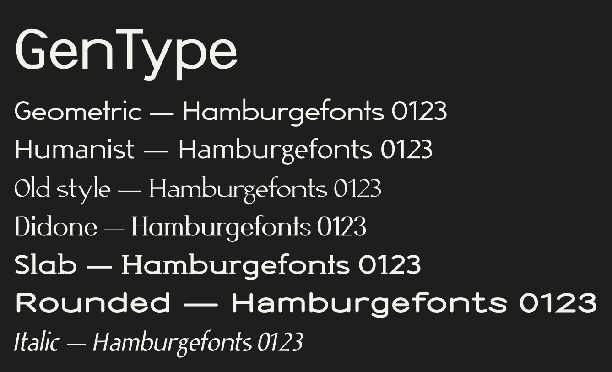

# GenType

Open-source **generative typography**: shape letter skeletons, choose a construction, turn the dials, and export production-ready `.ttf`, `.otf`, `.woff` and `.woff2` fonts — proper metrics, optical spacing, class kerning, f-ligatures and 330+ glyphs of Latin Extended coverage. No manual clean-up afterwards.



<sub>Four settings of the same skeleton set — regenerate with `node scripts/specimen.mjs docs/specimen.svg`.</sub>

## Why

Parametric type tools usually stop at "nice preview". GenType goes all the way to a font file you can install, hand to a client, or serve with `@font-face`. The same engine runs in the browser (live preview, ~70 ms for the whole character set) and on the server (export), so what you see is what you ship.

## Quick start

```bash
npm install
npm run setup:python   # fontTools + skia-pathops in server/.venv
npm run dev            # API on :5188, interface on http://localhost:3000
```

Production:

```bash
npm run build && npm start   # serves the built interface + API on :5188
```

Requirements: Node 20+, Python 3.9+.

## How it works

A **skeleton** is the armature of a letter: through-points connected by straight or curved links. Nothing about weight, contrast or terminals is baked into it — those come from the parameters, so one skeleton set yields a whole design space.

```
   design skeleton            parameters                 font
   ┌───────────┐    ┌──────────────────────────┐   ┌───────────┐
   │  A = two  │    │ weight · contrast · …     │   │ outlines  │
   │  diagonals│ ─► │ zone compensation         │─► │ + metrics │ ─► .ttf/.otf/.woff
   │  + a bar  │    │ Hobby splines             │   │ + kerning │
   └───────────┘    │ stroke expansion          │   └───────────┘
                    └──────────────────────────┘
```

1. **Skeletons** (`shared/glyphs/latin.js`) are authored on a fixed design grid (x-height 500, caps 700, ascender 750, descender −220) in a compact METAFONT-flavoured notation.
2. **Zone mapping** rescales that grid to the project's vertical metrics, then *zone compensation* pulls strokes inward so edges — not centerlines — land exactly on the baseline, x-height and cap line, with a touch of overshoot on curves.
3. **Splines**: connections become cubic Béziers using John Hobby's velocity function; the Tension dial is literally Hobby's tension.
4. **Stroke expansion** offsets each stroke by a width that depends on its direction (broad-nib contrast), adds terminals (flat, round, flared), miters corners, grows bracketed serifs, and removes the swallowtails tight curves produce.
5. **Auto-metrics** space every glyph by equal optical white (the HT Letterspacer idea) and kern pairs by how close two shapes actually get compared with two straight stems.
6. **Export** fits the sampled outlines back to Béziers (Schneider, with on-curve points at every extreme), then Python assembles the binary with fontTools: overlaps removed via skia-pathops, cubics kept for CFF or converted with cu2qu for TrueType, kerning and ligatures written as real OpenType features.

## The parameters

Structure — what kind of letters:

| Parameter | What it does |
|---|---|
| **Construction** | `geometric` (single-storey a, straight-tailed y, circular rounds, vertical stress), `grotesque` (closed forms, level terminal cuts, narrower rounds) or `humanist` (binocular g, kicked R, splayed M, diagonal stress, open forms). |
| **Aperture** 0–100 | How far the terminals of c, e, s, a, 2, 3, 5… travel round their curve: closed like Helvetica or open like Frutiger. |
| **Slant** 0–14° | Italic angle. Outlines, accents and the editor all follow it; exports are flagged as Italic. |
| **Width** | condensed · normal · expanded. |

Stroke — how the letters are drawn:

| Parameter | What it does |
|---|---|
| **Weight** 0–100 | Stem thickness, 18–163 units. Heavier weights widen the skeleton a little and thin the horizontals so counters stay open. |
| **Contrast** 0–100 | Thick/thin ratio from a broad-nib model whose angle comes from the construction. |
| **Terminals** | `sharp` (flat cut), `rounded` (round cap), `flared` (widening toward free ends). |
| **Tension** 0–100 | Curve energy: low is soft and round, high is squarish. |
| **Modulation** 0–100 | Organic sinuosity: seeded wobble of node positions and stroke width. |
| **Seed** | Which random variation Modulation uses. Same seed ⇒ identical font, always. |
| **Serif mode** | Serifs on stem ends: long unbracketed slabs when contrast is low, hairlines with brackets when it is high. |

Nine starting points (`shared/engine/presets.js`) set structure, proportions and dials together: Swiss, Geometric, Humanist, Old style, Didone, Slab, Rounded, Italic, Hand.

Vertical metrics (x-height, cap height, ascender, descender) and a global spacing percentage live in the Metrics view; every skeleton follows them.

## The interface

- **Skeleton** — p5 canvas editor: drag nodes, insert on a segment, draw new strokes with the pen, toggle straight/curved links, corners and fixed tangents, undo/redo, or edit the skeleton source as text. Only base glyphs and accents are editable; accented glyphs follow their base automatically.
- **Parameters** — construction, structure and stroke dials, nine starting points, and the whole character set redrawing live.
- **Metrics** — vertical zones, automatic kerning on/off, and editable tables for every kerning pair and advance width. Overrides are stored in the project; everything else is computed.
- **Preview** — set your own text at any size, with kerning and ligatures switchable.
- **Export** — pick a format, download, or load the compiled font into the page to test it for real.

Projects autosave to the browser and can be saved as `.gentype` files (plain JSON: parameters, metrics, and only the skeletons you edited). `Cmd/Ctrl+S` saves, `Cmd/Ctrl+O` opens, `Cmd/Ctrl+E` jumps to Export, `Cmd/Ctrl+Z` undoes skeleton edits.

## API

| Endpoint | Purpose |
|---|---|
| `GET /api/health` | Server + Python toolchain status. |
| `GET /api/glyphs` | Editable glyph list and parameter definitions. |
| `POST /api/generate-glyph` | `{ project, glyph }` → SVG path, advance, sidebearing, skeleton source. |
| `POST /api/calculate-metrics` | `{ project }` → advance widths, kerning pairs, vertical zones. |
| `POST /api/export-font` | `{ project, format }` → the font binary as a download. |

`project` is the contents of a `.gentype` file. Everything is validated and clamped on the way in, so a malformed project can't reach the engine.

```bash
curl -X POST localhost:5188/api/export-font \
  -H 'content-type: application/json' \
  -d '{"project":{"name":"Demo","params":{"weight":70,"contrast":60}},"format":"woff2"}' \
  -o Demo.woff2
```

## Layout

```
shared/engine/   the generation engine (runs in browser and Node)
  skeleton.js    notation, JSON form, validation
  spline.js      tangents + Hobby curves
  expand.js      stroke → outline, terminals, serifs, miters
  glyph.js       one glyph: wobble → zones → splines → outline
  metrics.js     profiles, optical spacing, kerning
  font.js        the whole set: composites, spacing, kerning
  fit.js         polyline → Bézier fitting for export
  export.js      compiler payload
  project.js     .gentype files
shared/glyphs/   skeleton data for 170 base glyphs, 16 accents, 130+ composites
client/          Vite app: views, worker, p5 editor
server/          Express API + Python compiler (fontTools, skia-pathops)
test/            engine invariants + end-to-end compilation
```

## Tests

```bash
npm test
```

Covers glyph integrity at extreme settings, zone alignment and overshoot, determinism per seed, kerning sanity, `.gentype` round-trips, payload validity, curve-fitting accuracy, and — when Python is installed — compiling all four formats and checking their signatures and tables.

## Adding or changing glyphs

Skeletons live in `shared/glyphs/latin.js`:

```js
A: ['A', 'upper', '0,0 -- 260,700; 260,700 -- 520,0; [noserif] 85,230 -- 435,230'],
//   char  case     stroke ; stroke ; stroke
```

- `--` straight link, `..` curved link
- `{deg}` pins the tangent direction, `^` makes a corner, `cycle` closes the stroke
- `[w=0.6]` scales that stroke's width, `[noserif]` keeps serifs off it, `[attach]` sticks a stroke to the dot it starts in, `[ap]` lets its free curved ends follow Aperture
- construction-specific alternates live in `VARIANTS` (e.g. the single-storey `a` for geometric)
- accented characters are declared in the composite table as `char base mark`

The same notation appears in the editor's *Skeleton source* box, so you can prototype in the browser and paste the result back into the data file.

## Known limits

- One weight per export: there is no variable-font axis yet (each export is a static instance).
- Latin only — no Greek, Cyrillic or complex scripts.
- Slant is an oblique (sheared) italic, not a cursive redesign of the letters.
- Hinting is not generated (CFF gets alignment zones and stem hints; TrueType ships unhinted).
- Deployment needs a Node host that can run Python — a container or a VPS, not a pure serverless edge function.

## License

MIT. The tool is open source and **the fonts you generate are yours**, with no attribution required.
